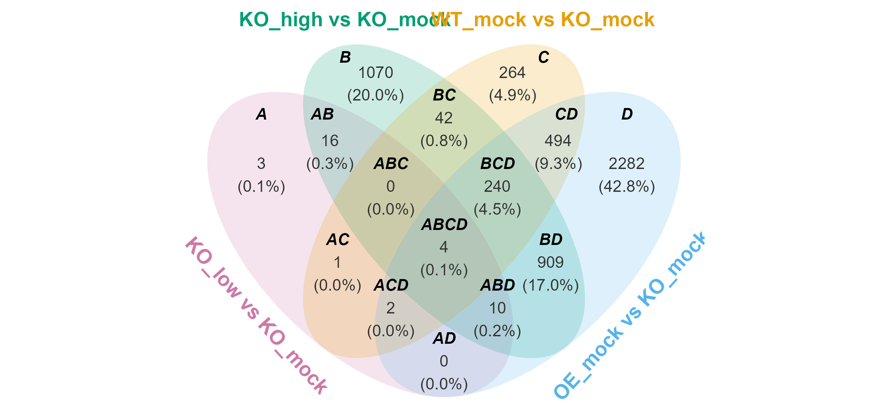
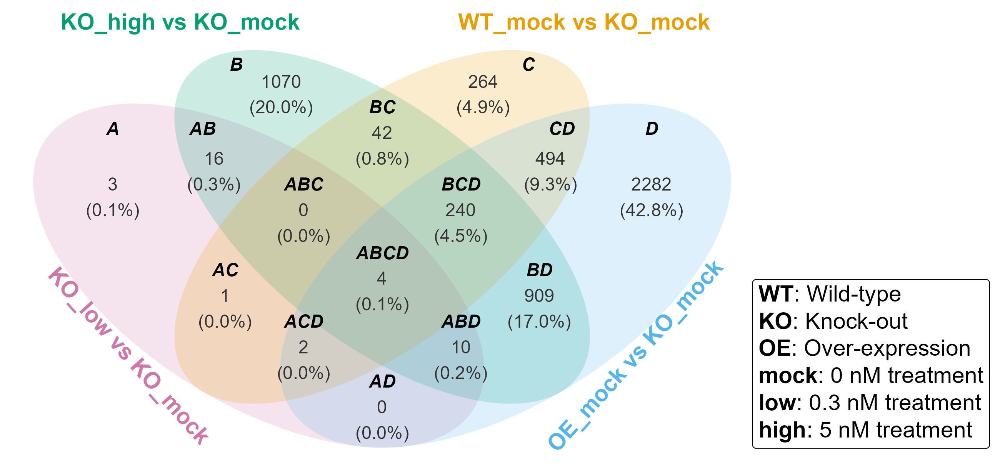

# **R package &mdash; venny**

`venny` is an R package for generating Venn diagram, summary tables, and ellipse paths for polygon clipping. 
It provides direct access to subsets of interest and offers flexible customization of Venn diagrams. 
Summary tables are also available when Venn diagram visualization is not suitable.

There are also other nice aletrnatives such as 
[`ggvenn`](https://cran.r-project.org/package=ggvenn), 
[`ggVennDiagram`](https://cran.r-project.org/package=ggVennDiagram), 
[`UpSetR`](https://cran.r-project.org/package=UpSetR), 
and other friends.

<!-- badges: start -->

[](https://cran.r-project.org/package=venny)
[](https://cran.r-project.org/package=venny)
[](https://github.com/P10911004-NPUST/venny/actions/workflows/R-CMD-check.yaml)
[](https://opensource.org/licenses/MIT)
[](https://cranlogs.r-pkg.org/badges/venny)
[](https://cranlogs.r-pkg.org/badges/venny)

<!-- badges: end -->

# Installation

You can install the package from [CRAN](https://cran.r-project.org/package=venny) with:

``` r
install.packages("venny")
```

or the development version from [GitHub](https://github.com/P10911004-NPUST/venny) with:

``` r
if (!require("devtools")) install.packages("devtools")
devtools::install_github("P10911004-NPUST/venny")
```

# Quick start

## Prerequisites
```r
library(venny)
library(ggplot2)
library(ggtext)
```

## Basic usage
```r
lst <- LGL23$DEGs
venny(lst)
```


## Customization
```r
setLabelPosition <- set_label_position(hjust = c(0.2, -0.5, 0.5, -0.2))

caption <- paste(
    "<b>WT</b>: Wild-type",
    "<b>KO</b>: Knock-out",
    "<b>OE</b>: Over-expression",
    "<b>mock</b>: 0 nM treatment",
    "<b>low</b>: 0.3 nM treatment",
    "<b>high</b>: 5 nM treatment",
    sep = "<br>"
)

venny(
    data = lst, 
    set.label.position = setLabelPosition
) + 
    annotate(
        geom = "richtext", 
        x = 3.3, y = -1.6, 
        label = caption, 
        hjust = 0, 
        size = 5
    ) +
    coord_cartesian(xlim = c(-3, 5.1))
```



## Murmur