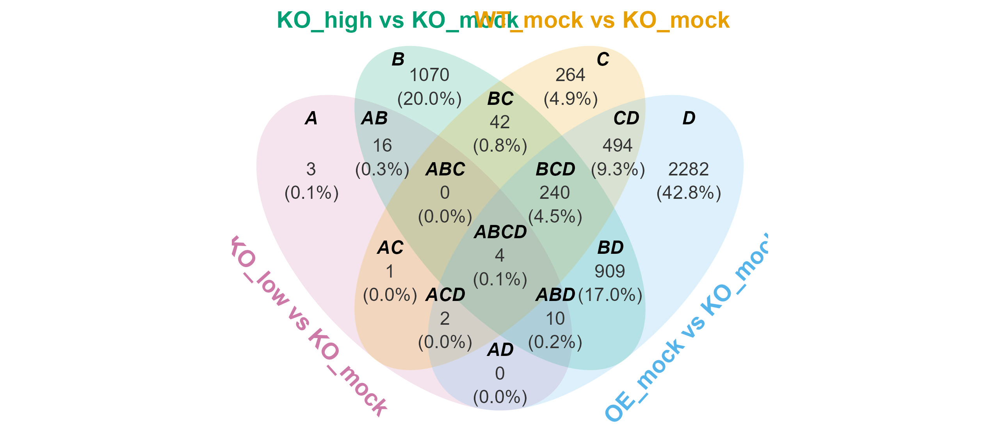
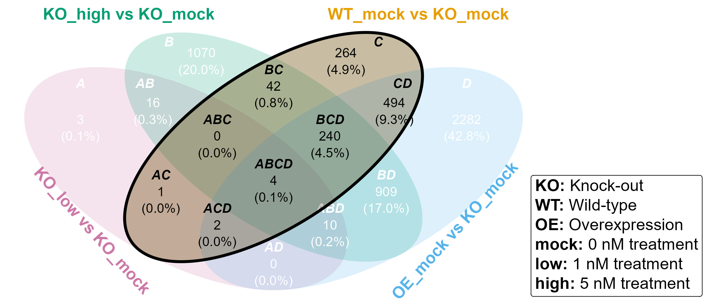
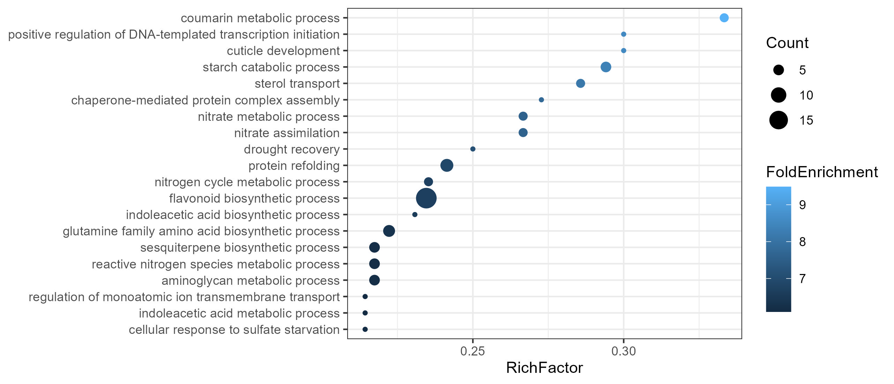
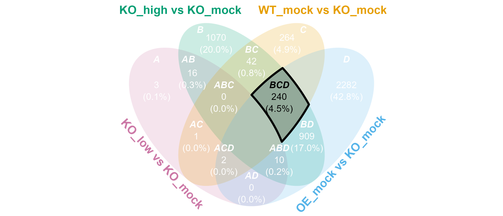
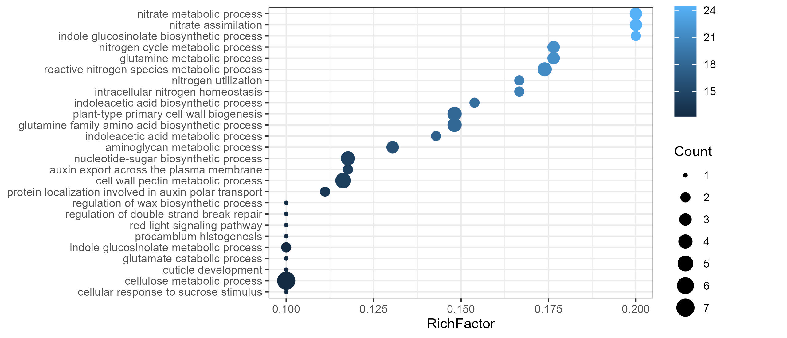

# **venny**

<!-- badges: start -->
[](https://cran.r-project.org/package=venny)
[](https://cran.r-project.org/package=venny)
[](https://github.com/P10911004-NPUST/venny/actions/workflows/R-CMD-check.yaml)
[](https://opensource.org/licenses/MIT)
[](https://cranlogs.r-pkg.org/badges/venny)
[](https://cranlogs.r-pkg.org/badges/venny)
<!-- badges: end -->

`venny` is an R package for generating Venn diagram, summary tables, and ellipse paths for polygon clipping. 
It provides direct access to subsets of interest and offers flexible customization of Venn diagrams. 
Summary tables are also available when Venn diagram visualization is not suitable.

There are also other nice alternatives such as 
[`ggvenn`](https://cran.r-project.org/package=ggvenn), 
[`ggVennDiagram`](https://cran.r-project.org/package=ggVennDiagram), 
[`UpSetR`](https://cran.r-project.org/package=UpSetR), 
and other friends.

# Installation

You can install the package from [CRAN](https://cran.r-project.org/package=venny) with:

``` r
install.packages("venny")
```

or the developmental version from [GitHub](https://github.com/P10911004-NPUST/venny) with:

``` r
if (!require("devtools")) install.packages("devtools")
devtools::install_github("P10911004-NPUST/venny")
```

# Quick start
```r
lst <- LGL23$DEGs
venny(lst)
```



# Case study

This is not a fully realistic case study. The primary purpose is to demonstrate how to use this package, rather than to present a rigorous academic analysis.

## Prerequisites
```r
if (!require(venny)) install.packages("venny")
if (!require(tidyverse)) install.packages("tidyverse")
if (!require(ggtext)) install.packages("ggtext")
if (!require(BiocManager)) install.packages("BiocManager")
if (!require(clusterProfiler)) BiocManager::install("clusterProfiler")
if (!require(org.At.tair.db)) BiocManager::install("org.At.tair.db")
library(venny)
library(tidyverse)
library(ggtext)
library(clusterProfiler)
library(org.At.tair.db)

intersect <- venny::intersect
setdiff <- venny::setdiff
union <- venny::union
```

## Background information

```r
lst <- LGL23$DEGs
print(names(lst))
```

The `LGL23` object is an RNA-seq dataset stored as a list containing the following components:

- sample_info: A data frame containing the genotype and treatment information for each sample ID.
- GFD: A data frame containing gene functional descriptions and annotations.
- count_matrix: A matrix of raw read counts representing the expression level of each gene across all sample IDs.
- DEGs: A list of differentially expressed genes (DEGs). This is an example for illustration.
  - KO_low vs KO_mock: 
    Genes that are differentially expressed in the knockout (KO) plant after low-dose chemical treatment compared with the untreated KO control. The KO plant is a genetically modified line in which a specific gene (e.g., gene_X) has been disrupted or deleted.
  - KO_high vs KO_mock: 
    Similar to KO_low vs KO_mock, but the KO plant is treated with a high dose of the chemical.
  - WT_mock vs KO_mock: 
    Genes that are differentially expressed between the wild-type (WT) plant and the untreated KO plant under mock-treatment conditions.
  - OE_mock vs KO_mock: 
    Genes that are differentially expressed between the overexpression (OE) plant and the untreated KO plant under mock-treatment conditions. The OE plant is a genetically modified line in which gene_X is highly expressed or constitutively activated. Ideally, the transcriptional profile of OE_mock should resemble that of KO_high.


## Loss-of-function (Set C)

To investigate the function of the target gene, we compared gene expression profiles between the WT and KO plants under untreated conditions. Differentially expressed genes (DEGs) identified from this comparison may provide insights into the biological roles and regulatory functions of the target gene.

```r
subset_names <- names(subset_label_default(length(lst)))
select_subsets <- c("C", "BC", "CD", "ABC", "BCD", "AC", "ABCD", "ACD")
font_color <- sapply(subset_names, \(x) if (x %in% select_subsets) "black" else "white")

out <- venny(
    data = lst,
    detail = TRUE,
    set.label.position = set_label_position(hjust = c(0.2, -0.5, 0.5, -0.2)),
    subset.label.font = subset_label_font(color = font_color),
    subset.count.font = subset_count_font(color = font_color),
    subset.percentage.font = subset_percentage_font(color = font_color)
)

venn <- out$venn
setops <- out$ellipse_path$`WT_mock vs KO_mock`

highlight(venn, setops, linetype = "solid", color = "black") +
    coord_cartesian(xlim = c(-3, 5)) +
    annotate("richtext",
        x = 3.2, y = -1.6,
        hjust = 0,
        size = 5,
        label = paste(
            "<b>KO:</b> Knock-out",
            "<b>WT:</b> Wild-type",
            "<b>OE:</b> Overexpression",
            "<b>mock:</b> 0 nM treatment",
            "<b>low:</b> 1 nM treatment",
            "<b>high:</b> 5 nM treatment",
            sep = "<br>"
        ),
    )
```


Target genes can be extracted from the DEGs and further analyzed using Gene Ontology (GO) enrichment analysis. The results suggest that the gene is involved in regulating nitrogen metabolism. Consistent with this finding, we observed clear phenotypic differences between WT and KO plants under nitrogen-deficient conditions. Additionally, responses under sulfate starvation and drought recovery reveal potential new functional roles of the gene, providing directions for future investigation.

```r
GO <- clusterProfiler::enrichGO(
    gene = LGL23$DEGs$`WT_mock vs KO_mock`,
    OrgDb = org.At.tair.db,
    keyType = "TAIR",
    ont = "BP"
)

GO@result |>
    slice_max(RichFactor, n = 20) |>
    ggplot(aes(RichFactor, fct_reorder(Description, RichFactor))) +
    theme_bw() +
    geom_point(aes(size = Count, color = FoldEnrichment)) +
    theme(axis.title.y = element_blank())
```



## High-dosage recovery (Subset BCD)

We compared transcriptomic responses induced by high-dose exogenous chemical treatment in the knockout line (KO_high), endogenous overexpression of the target gene in the OE line (OE_mock), and the wild-type control (WT_mock), each relative to the untreated knockout condition (KO_mock). This integrative comparison was used to evaluate whether the exogenous chemical can phenocopy endogenous activation of the pathway and whether its transcriptional effects converge toward a wild-type-like state.

```r
select_subsets <- "BCD"
font_color <- sapply(subset_names, \(x) if (x %in% select_subsets) "black" else "white")

BCD <- venny(
    data = lst,
    detail = TRUE,
    set.label.position = set_label_position(hjust = c(0.2, -0.5, 0.5, -0.2)),
    subset.label = list(CD = "", ABCD = ""),
    subset.label.font = subset_label_font(color = font_color),
    subset.count.position = subset_count_position(hide = c("CD", "ABCD")),
    subset.count.font = subset_count_font(color = font_color),
    subset.percentage.position = subset_percentage_position(hide = c("CD", "ABCD")),
    subset.percentage.font = subset_percentage_font(color = font_color)
)

venn <- BCD$venn
ep <- BCD$ellipse_path
setops <- ep$`KO_high vs KO_mock` |>
    intersect(ep$`WT_mock vs KO_mock`, ep$`OE_mock vs KO_mock`) |>
    setdiff(ep$`KO_low vs KO_mock`)

highlight(venn, setops, linetype = "solid", color = "black")
```



Across all three contrasts, we observed a consistent enrichment of genes involved in nitrogen metabolism, suggesting that KO_high, OE_mock, and WT_mock share a common regulatory signature in this pathway. This result supports the hypothesis that the synthesized chemical functionally mimics the endogenous gene activity and partially restores wild-type-like nitrogen metabolic regulation in the KO background.

```r
GO <- clusterProfiler::enrichGO(
    gene = BCD$subset_elements$BCD,
    OrgDb = org.At.tair.db,
    keyType = "TAIR",
    ont = "BP"
)

GO@result |>
    slice_max(RichFactor, n = 20) |>
    ggplot(aes(RichFactor, fct_reorder(Description, RichFactor))) +
    theme_bw() +
    geom_point(aes(size = Count, color = FoldEnrichment)) +
    theme(axis.title.y = element_blank())
```


<br>
<h2 style="text-align: center">The End !!!</h2>

<br>

# TODO
- [] Implement upset plot (depend on ggplot2 only)