# venny

## 1. Overview

The `venny` package provides an integrated workflow for exploring
relationships among sets with Venn diagrams, summary tables, and
polygon-based set operations.

Its functionality can be summarized as:

- **Venn diagram visualization** for 2 to 4 sets;
- **subset summaries**, including the number and percentage of elements
  in each region;
- **direct access to subset elements** for downstream analysis;
- **ellipse paths** underlying the Venn diagram, which can be reused as
  polygons;
- **set operations on polygon paths**, including intersection, union,
  and set difference;
- **highlighting selected regions** of an existing Venn diagram;
- **fine-grained control** over labels, positions, fonts, fills, lines,
  and transparency.

The package is particularly useful when a Venn diagram is not only the
final visualization, but also an intermediate object for subsequent
set-based analysis.

  

## 2. Installation

Install the released version from CRAN:

``` r

install.packages("venny")
```

Or install the development version from GitHub:

``` r

if (!require("pak")) install.packages("pak")
pak::pak("P10911004-NPUST/venny")
```

Then load the package:

``` r

library(venny)
#> 
#> Attaching package: 'venny'
#> The following objects are masked from 'package:base':
#> 
#>     intersect, setdiff, union
```

  

## 3. Quick start

The simplest input is a named list containing two to four vectors.

``` r

venny(LGL23$DEGs)
```

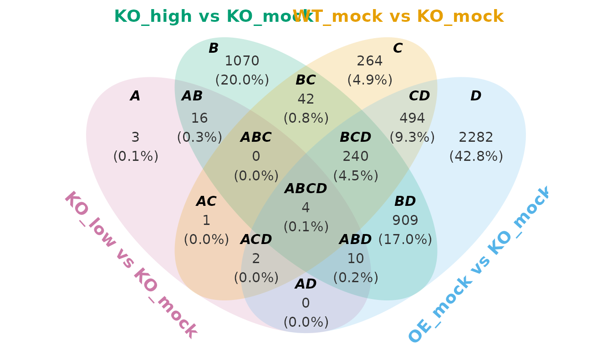

A practical usage scenario:

The names of the list are used as the set labels. If the input list is
unnamed, `venny` automatically uses labels such as `Set_A`, `Set_B`, and
`Set_C`.

``` r

data <- list(1:100, 51:150)
venny(unname(LGL23$DEGs))
```

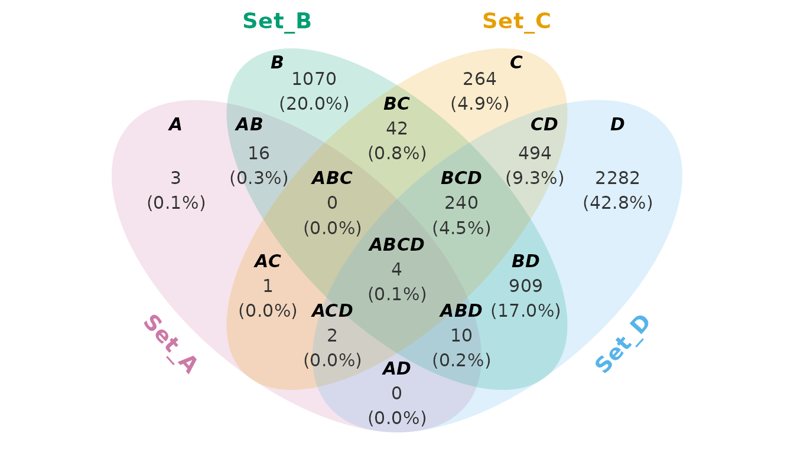

The basic plot is a `ggplot` object, so ordinary `ggplot2` layers can be
added to it.

  

## 4. Understanding the subsets

For three sets, the possible subsets are represented by labels such as
`A`, `AB`, `ABC`, and so on.

``` r

venny(unname(LGL23$DEGs[-4]))
```

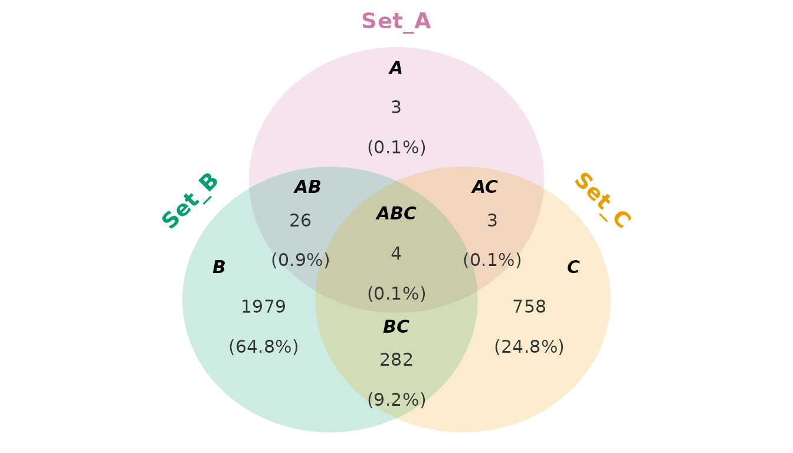

For example:

- `A` = elements belonging only to set A;
- `AB` = elements belonging to A and B but not C;
- `ABC` = elements shared by all three sets.

The helper
[`how_many_subsets()`](https://p10911004-npust.github.io/venny/reference/how_many_subsets.md)
can be used to determine how many subsets are possible.

``` r

how_many_subsets(c("A", "B", "C"))
#> [1] 7
how_many_subsets(c("A", "B", "C"), detail = TRUE)
#> $N
#> [1] 7
#> 
#> $combinations
#> [1] "A"   "B"   "C"   "AB"  "AC"  "BC"  "ABC"
```

The corresponding binary representation can be generated with
[`bits_encoding()`](https://p10911004-npust.github.io/venny/reference/bits_encoding.md):

``` r

bits_encoding(c("A", "B", "C"))
#>     A B C
#> A   1 0 0
#> B   0 1 0
#> AB  1 1 0
#> C   0 0 1
#> AC  1 0 1
#> BC  0 1 1
#> ABC 1 1 1
```

This is useful when constructing or inspecting subset definitions
programmatically.

  

## 5. Summary tables

When the numerical summary is more important than the diagram, use
[`venn_summary()`](https://p10911004-npust.github.io/venny/reference/venn_summary.md).

``` r

out <- venn_summary(LGL23$DEGs)
out$table
#>      A B C D subset n_elements percentage
#> A    1 0 0 0      A          3        0.1
#> B    0 1 0 0      B       1070       20.0
#> AB   1 1 0 0     AB         16        0.3
#> C    0 0 1 0      C        264        4.9
#> AC   1 0 1 0     AC          1        0.0
#> BC   0 1 1 0     BC         42        0.8
#> ABC  1 1 1 0    ABC          0        0.0
#> D    0 0 0 1      D       2282       42.8
#> AD   1 0 0 1     AD          0        0.0
#> BD   0 1 0 1     BD        909       17.0
#> ABD  1 1 0 1    ABD         10        0.2
#> CD   0 0 1 1     CD        494        9.3
#> ACD  1 0 1 1    ACD          2        0.0
#> BCD  0 1 1 1    BCD        240        4.5
#> ABCD 1 1 1 1   ABCD          4        0.1
```

The summary contains the information needed to describe each subset.

This makes
[`venn_summary()`](https://p10911004-npust.github.io/venny/reference/venn_summary.md)
useful as a bridge between visualization and downstream analysis. For
example, a specific subset can be extracted and passed to enrichment
analysis, annotation, or another statistical workflow.

  

## 6. Obtaining detailed output

By default,
[`venny()`](https://p10911004-npust.github.io/venny/reference/venny.md)
returns a Venn diagram. Set `detail = TRUE` to obtain the diagram
together with the objects needed for downstream analysis.

``` r

out <- venny(LGL23$DEGs, detail = TRUE)
names(out)
#> [1] "venn"            "ellipse_path"    "table"           "subset_elements"
```

The returned object contains:

- `venn` — the Venn diagram as a `ggplot` object;
- `ellipse_path` — polygon coordinates for the individual ellipses;
- `table` — the subset summary table;
- `subset_elements` — the elements belonging to each subset.

For example:

``` r

out$venn
```


The summary table can be inspected directly:

``` r

out$table
#>      A B C D subset n_elements percentage
#> A    1 0 0 0      A          3        0.1
#> B    0 1 0 0      B       1070       20.0
#> C    0 0 1 0      C        264        4.9
#> D    0 0 0 1      D       2282       42.8
#> AB   1 1 0 0     AB         16        0.3
#> BC   0 1 1 0     BC         42        0.8
#> CD   0 0 1 1     CD        494        9.3
#> AC   1 0 1 0     AC          1        0.0
#> AD   1 0 0 1     AD          0        0.0
#> BD   0 1 0 1     BD        909       17.0
#> ABC  1 1 1 0    ABC          0        0.0
#> BCD  0 1 1 1    BCD        240        4.5
#> ACD  1 0 1 1    ACD          2        0.0
#> ABD  1 1 0 1    ABD         10        0.2
#> ABCD 1 1 1 1   ABCD          4        0.1
```

And the elements belonging to a particular subset can be retrieved from:

``` r

out$subset_elements$ABC
#> character(0)
```

  

## 7. Customizing the Venn diagram

[`venny()`](https://p10911004-npust.github.io/venny/reference/venny.md)
separates plot customization into several parameter functions. This
allows the same parameter object to be reused across multiple diagrams.

### 7.1 Ellipse lines and fills

Use
[`ellipse_line()`](https://p10911004-npust.github.io/venny/reference/ellipse_line.md)
and
[`ellipse_fill()`](https://p10911004-npust.github.io/venny/reference/ellipse_line.md)
to control the appearance of the ellipses, *i.e.* set boundaries and
interiors.

``` r

venny(
    LGL23$DEGs,
    ellipse.line = ellipse_line(color = c("red", "transparent", "red", "navy"),
                                linetype = "solid", 
                                linewidth = 2, 
                                alpha = 0.8),
    ellipse.fill = ellipse_fill(color = c("gray", "red", "navy", "orange"),
                                alpha = 0.25)
)
```

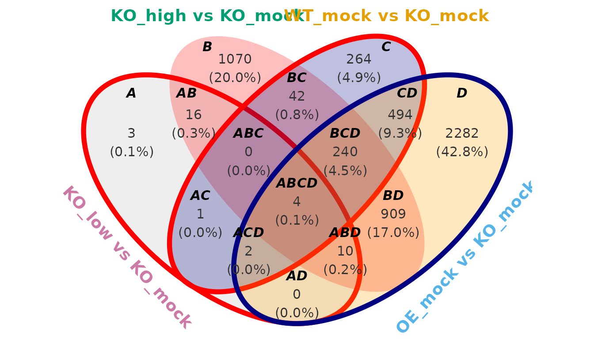

The default palette is designed to provide distinct colors for up to
four sets.

### 7.2 Set labels

Set labels are the names for each datasets. For example, the set labels
of `LGL23$DEGs` are:

``` r

names(LGL23$DEGs)
#> [1] "KO_low vs KO_mock"  "KO_high vs KO_mock" "WT_mock vs KO_mock"
#> [4] "OE_mock vs KO_mock"
```

However, the set labels for internal recognition is fixed as
[`set_label_default()`](https://p10911004-npust.github.io/venny/reference/set_label_default.md).
The positioning are:

| Number of sets | Internal set labels |             Positioning              |
|:--------------:|:-------------------:|:------------------------------------:|
|       2        |        A, B         |            left -\> right            |
|       3        |       A, B, C       | upper -\> lower left -\> lower right |
|       4        |     A, B, C, D      |   start from lower left, clockwise   |

So, when you want to assign the selected sets to the parameters-related
function, do not use the user-defined set labels. For example, if you
want to hide the set labels of “KO_low vs KO_mock” (lower left) and
“OE_mock vs KO_mock” (upper right), you need to select “A” and “C”.

``` r

venny(
    LGL23$DEGs,
    set.label.position = set_label_position(
        hjust = c(0, -1, 0.5, 0),
        hide = c("A", "C")
    )
)
```

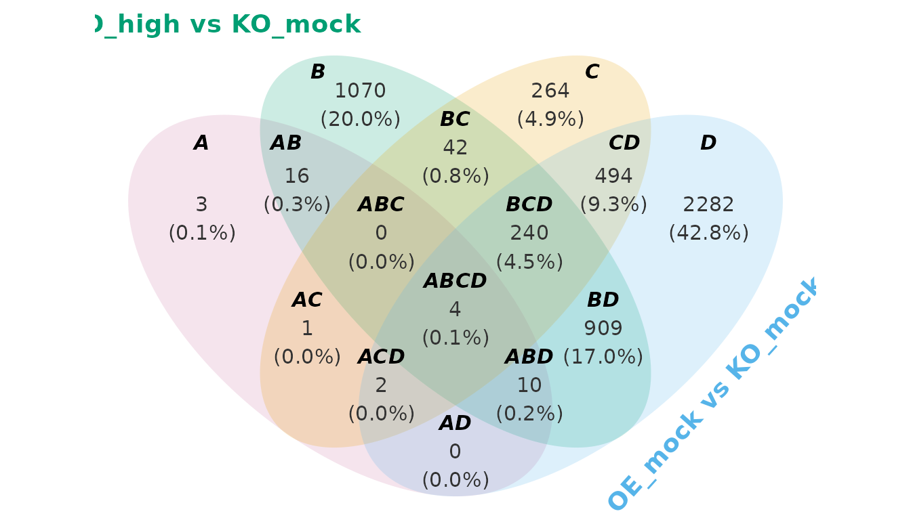

The appearance of set labels is controlled with
[`set_label_font()`](https://p10911004-npust.github.io/venny/reference/set_label_font.md):

``` r

venny(
    LGL23$DEGs,
    set.label.font = set_label_font(
        face = "italic",
        size = 7
    )
)
```

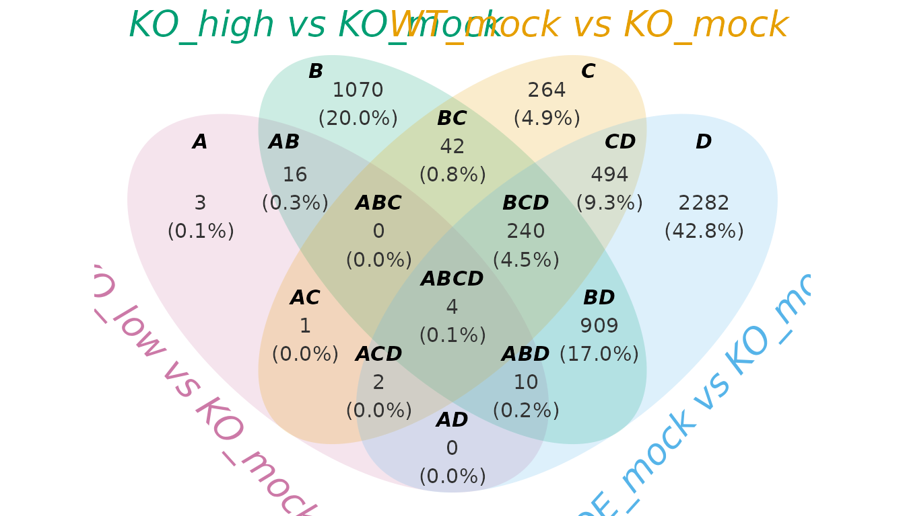

### 7.3 Subset labels

Subset labels can be customized via `subset_*_*()` functions
independently of set labels. The subset labels can be renamed by
assigning a list of (old_name = new_name) to the `subset.label`
argument.

``` r

subset_font_color <- vapply(
    subset_label_default(4), 
    function(x) if (x %in% c("A", "B", "C", "D")) "maroon" else "blue",
    FUN.VALUE = character(1)
)

venny(
    LGL23$DEGs,
    subset.label = list(
        A = "Apple",
        B = "Banana",
        C = "Coconut",
        D = "Durian"
    ),
    subset.label.font = subset_label_font(
        color = subset_font_color
    )
)
```

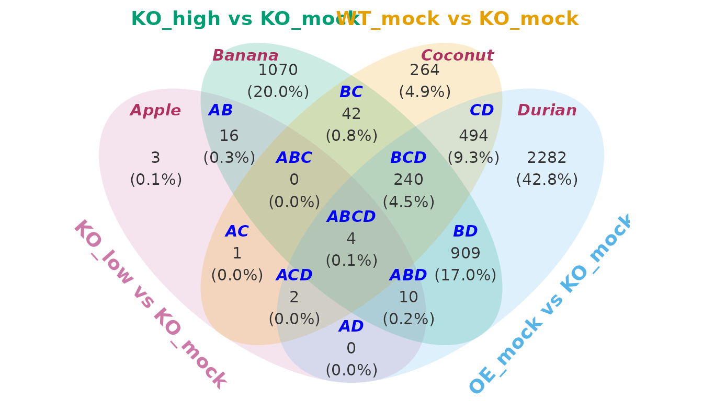

### 7.4 Counts and percentages

Counts and percentages are independent layers.

``` r

nm <- subset_label_default(4)
font_color <- fixed_length(c("red", "blue", "maroon"), length(nm))
font_angle <- fixed_length(c(30, 60, 90, 180), length(nm))
show_subset_perc <- c("A", "B", "C", "D", "AB", "ACD", "BC", "CD", "ABCD")

venny(
    LGL23$DEGs,
    subset.count = TRUE,
    subset.count.font = subset_count_font(family = "serif",
                                          color = font_color,
                                          angle = font_angle),
    subset.percentage = TRUE,
    subset.percentage.rounding = 1,
    subset.percentage.position = subset_percentage_position(show = show_subset_perc),
)
```

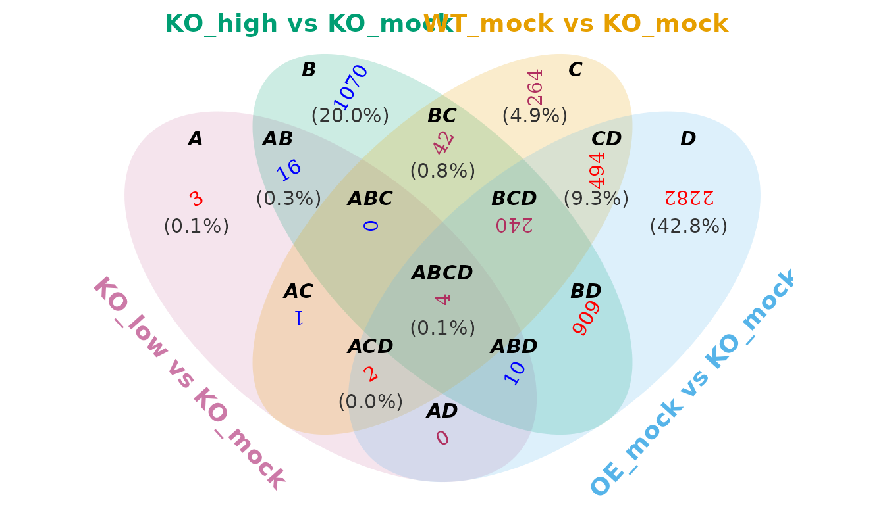

For example:

``` r

venny(
    LGL23$DEGs,
    subset.count.font = subset_count_font(
        face = "bold",
        size = 4
    ),
    subset.percentage.font = subset_percentage_font(
        size = 3.5
    )
)
```

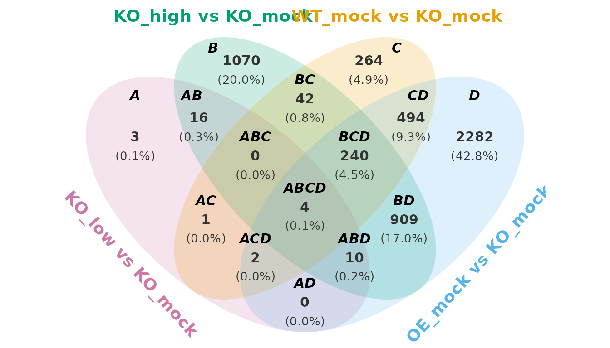

  

## 8. Working with ellipse paths

One of the distinctive features of `venny` is that the Venn diagram is
not treated only as a picture. The individual ellipses are returned as
polygon coordinates.

``` r

out <- venny(LGL23$DEGs, detail = TRUE)
names(out$ellipse_path)
#> [1] "KO_low vs KO_mock"  "KO_high vs KO_mock" "WT_mock vs KO_mock"
#> [4] "OE_mock vs KO_mock"
```

Each element of `out$ellipse_path` contains the coordinates needed to
draw the corresponding polygon. You can inspect one ellipse directly:

``` r

head(out$ellipse_path$`KO_low vs KO_mock`)
#>              x         y
#> [1,] 0.6777670 -2.336767
#> [2,] 0.7070210 -2.305751
#> [3,] 0.7344838 -2.273003
#> [4,] 0.7601279 -2.238557
#> [5,] 0.7839277 -2.202447
#> [6,] 0.8058596 -2.164708
```

The lower-level
[`generate_ellipse_path()`](https://p10911004-npust.github.io/venny/reference/generate_ellipse_path.md)
function can also be used independently.

``` r

circle <- generate_ellipse_path(
    x0 = 0,
    y0 = 0,
    a = 1,
    b = 1
)

head(circle)
#>              x          y
#> [1,] 1.0000000 0.00000000
#> [2,] 0.9995016 0.03156855
#> [3,] 0.9980069 0.06310563
#> [4,] 0.9955173 0.09457981
#> [5,] 0.9920354 0.12595971
#> [6,] 0.9875646 0.15721404
```

Because the result is a data frame of `(x, y)` coordinates, it can be
plotted with `ggplot2`:

``` r

ggplot2::ggplot(
    circle,
    ggplot2::aes(x, y)
) +
    ggplot2::geom_polygon() +
    ggplot2::coord_fixed() +
    ggplot2::theme_void()
```


  

## 9. Set operations on Venn regions

The ellipse paths returned by
[`venny()`](https://p10911004-npust.github.io/venny/reference/venny.md)
can be combined with set operations.

The package provides methods for:

- [`intersect()`](https://p10911004-npust.github.io/venny/reference/setops.md):
  {A} ∩ {B} ∩ … – the common elements shared by the sets;
- [`union()`](https://p10911004-npust.github.io/venny/reference/setops.md):
  {A} ∪ {B} ∪ … – all elements in the sets;
- [`setdiff()`](https://p10911004-npust.github.io/venny/reference/setops.md):
  {A} − {B} − … – subtraction from the previous sets.

These operations can subsequently be displayed with
[`highlight()`](https://p10911004-npust.github.io/venny/reference/highlight.md)
or
[`ggplot2::geom_polygon`](https://ggplot2.tidyverse.org/reference/geom_polygon.html).
The
[`highlight()`](https://p10911004-npust.github.io/venny/reference/highlight.md)
is a convenient wrapper around
[`ggplot2::geom_polygon()`](https://ggplot2.tidyverse.org/reference/geom_polygon.html)
for displaying the result of a polygon operation.

### 9.1 Intersection

``` r

out <- venny(unname(LGL23$DEGs), detail = TRUE)
ep <- out$ellipse_path
setops <- venny::intersect(ep$Set_A, ep$Set_B, ep$Set_D)
highlight(out$venn, setops)
```

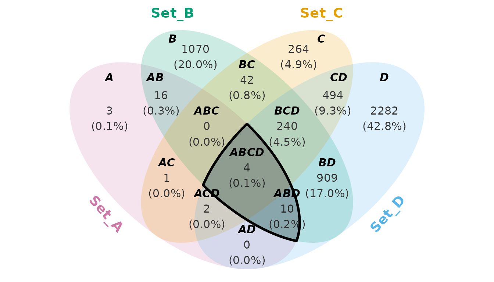

This highlights the region shared by A, B, and D. Because
[`highlight()`](https://p10911004-npust.github.io/venny/reference/highlight.md)
returns a `ggplot` object, additional layers can be added. For example

``` r

highlight(
    out$venn,
    setops,
    color = "red",
    fill = "red",
    alpha = 0.25
) +
    ggplot2::annotate(
        "text",
        x = 0,
        y = 2.5,
        label = "A ∩ B ∩ D",
        fontface = "bold"
    )
```

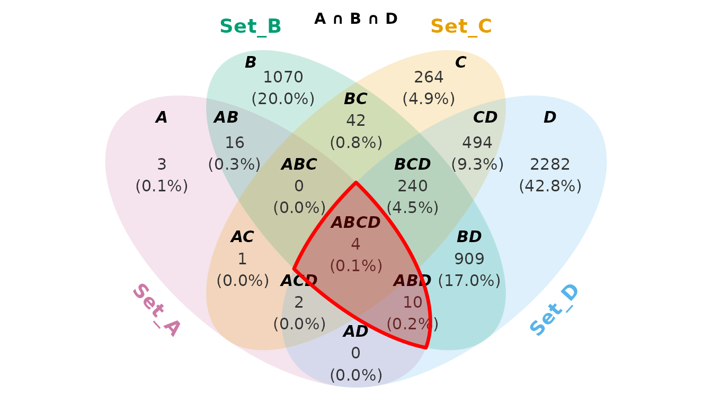

### 9.2 Union

``` r

setops <- venny::union(ep$Set_A, ep$Set_C, ep$Set_D)
highlight(out$venn, setops)
```

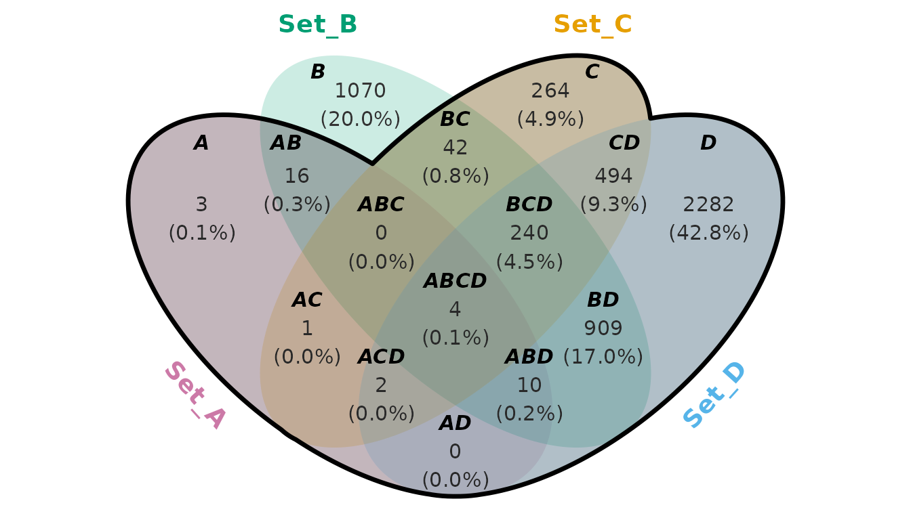

### 9.3 Set difference

``` r

setops <- venny::setdiff(ep$Set_B, ep$Set_D)
highlight(out$venn, setops)
```

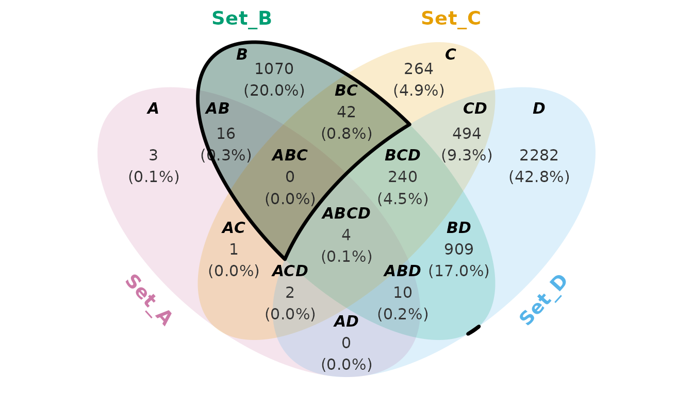

### 9.4 Chaining operations

Set operations can be chained to describe more complex regions.

``` r

setops <- venny::union(ep$Set_A, ep$Set_B, ep$Set_C) |>
    venny::intersect(ep$Set_D) |>
    venny::setdiff(ep$Set_B)
highlight(out$venn, setops)
```

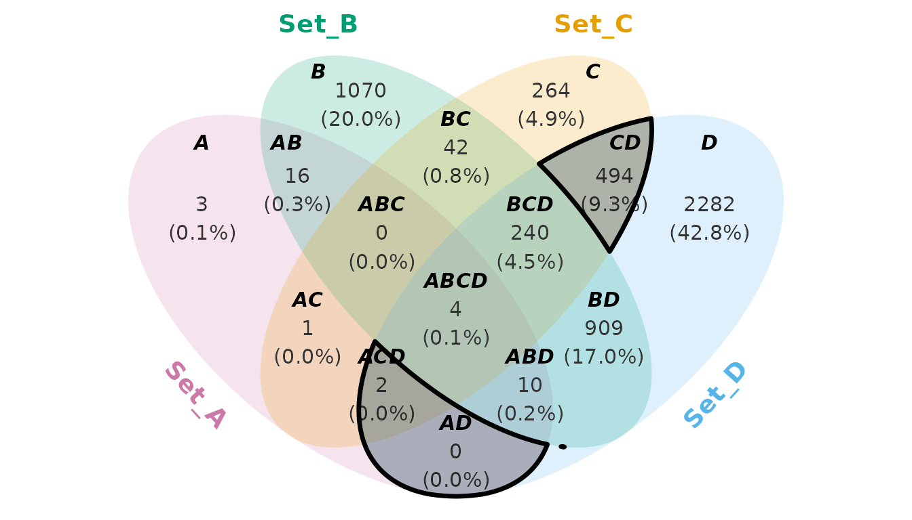

This approach is useful when the region of interest cannot be described
simply by selecting a single named Venn subset.

  

## 10. RNA-seq example

This is not a fully realistic case study. The purpose is to demonstrate
how to use this package, rather than to present a rigorous academic
analysis.

### Prerequisites

``` r

if (!require(venny)) install.packages("venny")
if (!require(dplyr)) install.packages("dplyr")
if (!require(forcats)) install.packages("forcats")
if (!require(ggplot2)) install.packages("ggplot2")
if (!require(ggtext)) install.packages("ggtext")
if (!require(BiocManager)) install.packages("BiocManager")
if (!require(clusterProfiler)) BiocManager::install("clusterProfiler")
if (!require(org.At.tair.db)) BiocManager::install("org.At.tair.db")
library(venny)
library(dplyr)
library(forcats)
library(ggplot2)
library(ggtext)
library(clusterProfiler)
library(org.At.tair.db)

intersect <- venny::intersect
setdiff <- venny::setdiff
union <- venny::union
```

### Background information

``` r

lst <- LGL23$DEGs
print(names(lst))
#> [1] "KO_low vs KO_mock"  "KO_high vs KO_mock" "WT_mock vs KO_mock"
#> [4] "OE_mock vs KO_mock"
```

The `LGL23` object is an RNA-seq dataset stored as a list containing the
following components:

- sample_info: A data frame containing the genotype and treatment
  information for each sample ID.
- GFD: A data frame containing gene functional descriptions and
  annotations.
- count_matrix: A matrix of read counts (gene expression) across all
  sample IDs.
- DEGs: A list of differentially expressed genes (DEGs). This is an
  example for illustration.
  - KO_low vs KO_mock: Genes that are differentially expressed in the
    knockout (KO) plant after low-dose chemical treatment compared with
    the untreated KO control. The KO plant is a genetically modified
    line in which a specific gene (e.g., gene_X) has been disrupted or
    deleted.
  - KO_high vs KO_mock: Similar to KO_low vs KO_mock, but the KO plant
    is treated with a high dose of the chemical.
  - WT_mock vs KO_mock: Genes that are differentially expressed between
    the wild-type (WT) plant and the untreated KO plant under
    mock-treatment conditions.
  - OE_mock vs KO_mock: Genes that are differentially expressed between
    the overexpression (OE) plant and the untreated KO plant under
    mock-treatment conditions. The OE plant is a genetically modified
    line in which gene_X is highly expressed or constitutively
    activated. Ideally, the transcriptional profile of OE_mock should
    resemble that of KO_high.

### Loss-of-function (Set C)

To investigate the function of the target gene, we compared gene
expression profiles between the WT and KO plants under untreated
conditions. Differentially expressed genes (DEGs) identified from this
comparison may provide insights into the biological roles and regulatory
functions of the target gene.

``` r

subset_names <- names(subset_label_default(length(lst)))
select_subsets <- c("C", "BC", "CD", "ABC", "BCD", "AC", "ABCD", "ACD")
font_color <- sapply(subset_names, \(x) if (x %in% select_subsets) "red" else "navy")

out <- venny(
    data = lst,
    detail = TRUE,
    set.label.position = set_label_position(hjust = c(0.2, -0.5, 0.5, -0.2)),
    subset.label.font = subset_label_font(color = font_color),
    subset.count.font = subset_count_font(color = font_color),
    subset.percentage.font = subset_percentage_font(color = font_color)
)

venn <- out$venn
setops <- out$ellipse_path$`WT_mock vs KO_mock`

highlight(venn, setops, linetype = "solid", color = "red") +
    coord_cartesian(xlim = c(-3, 5)) +
    annotate("richtext",
        x = 3.2, y = -1.6,
        hjust = 0,
        size = 5,
        label = paste(
            "<b>KO:</b> Knock-out",
            "<b>WT:</b> Wild-type",
            "<b>OE:</b> Overexpression",
            "<b>mock:</b> 0 nM treatment",
            "<b>low:</b> 1 nM treatment",
            "<b>high:</b> 5 nM treatment",
            sep = "<br>"
        ),
    )
#> Coordinate system already present.
#> ℹ Adding new coordinate system, which will replace the existing one.
```

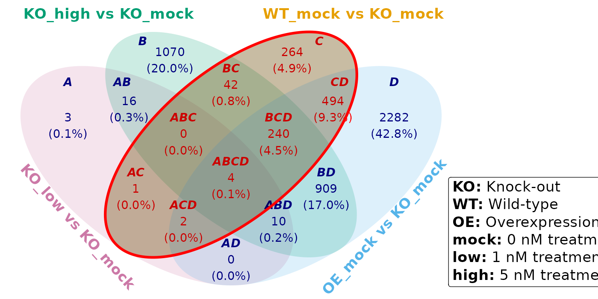

Target genes can be extracted from the DEGs and further analyzed using
Gene Ontology (GO) analysis. The results suggest that the gene is
involved in regulating nitrogen metabolism. Consistent with the finding,
we observed clear phenotypic differences between WT and KO plants under
nitrogen-deficient conditions. Additionally, responses under sulfate
starvation and drought recovery reveal potential new functional roles of
the gene, providing directions for future investigation.

``` r

GO <- clusterProfiler::enrichGO(
    gene = LGL23$DEGs$`WT_mock vs KO_mock`,
    OrgDb = org.At.tair.db,
    keyType = "TAIR",
    ont = "BP"
)
#> 'select()' returned 1:1 mapping between keys and columns
#> Warning in bitr(gene, fromType = fromType, toType = "ENTREZID", OrgDb = OrgDb):
#> 4.58% of input gene IDs are fail to map...

GO@result |>
    slice_max(RichFactor, n = 20) |>
    ggplot(aes(RichFactor, fct_reorder(Description, RichFactor))) +
    theme_bw() +
    geom_point(aes(size = Count, color = FoldEnrichment)) +
    theme(axis.title.y = element_blank())
```

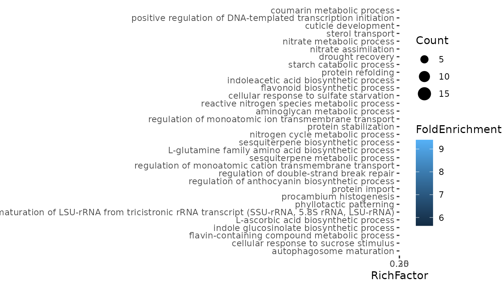

### High-dosage recovery (Subset BCD)

We compared transcriptomic responses induced by high-dose exogenous
chemical treatment in the knockout line (KO_high), endogenous
overexpression of the target gene in the OE line (OE_mock), and the
wild-type control (WT_mock), each relative to the untreated knockout
condition (KO_mock). This integrative comparison was used to evaluate
whether the exogenous chemical can phenocopy endogenous activation of
the pathway and whether its transcriptional effects converge toward a
wild-type-like state.

``` r

select_subsets <- "BCD"
font_color <- sapply(subset_names, \(x) if (x %in% select_subsets) "red" else "navy")

BCD <- venny(
    data = lst,
    detail = TRUE,
    set.label.position = set_label_position(hjust = c(0.2, -0.5, 0.5, -0.2)),
    subset.label.font = subset_label_font(color = font_color),
    subset.count.font = subset_count_font(color = font_color),
    subset.percentage.font = subset_percentage_font(color = font_color)
)

venn <- BCD$venn
ep <- BCD$ellipse_path
setops <- ep$`KO_high vs KO_mock` |>
    intersect(ep$`WT_mock vs KO_mock`, ep$`OE_mock vs KO_mock`) |>
    setdiff(ep$`KO_low vs KO_mock`)

highlight(venn, setops, linetype = "solid", color = "red")
```

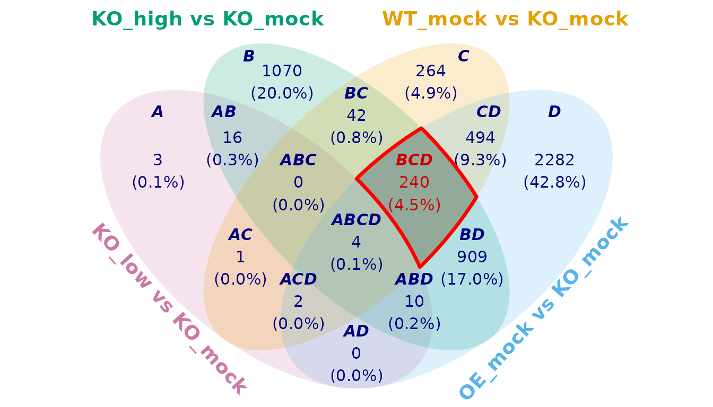

``` r

GO <- clusterProfiler::enrichGO(
    gene = BCD$subset_elements$BCD,
    OrgDb = org.At.tair.db,
    keyType = "TAIR",
    ont = "BP"
)
#> 'select()' returned 1:1 mapping between keys and columns
#> Warning in bitr(gene, fromType = fromType, toType = "ENTREZID", OrgDb = OrgDb):
#> 2.08% of input gene IDs are fail to map...

GO@result |>
    slice_max(RichFactor, n = 20) |>
    ggplot(aes(RichFactor, fct_reorder(Description, RichFactor))) +
    theme_bw() +
    geom_point(aes(size = Count, color = FoldEnrichment)) +
    theme(axis.title.y = element_blank())
```

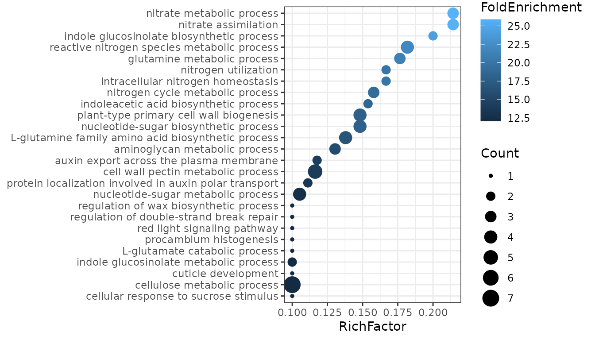

Across all three contrasts, we observed a consistent enrichment of genes
involved in nitrogen metabolism, suggesting that KO_high, OE_mock, and
WT_mock share a common regulatory signature in this pathway. This result
supports the hypothesis that the synthesized chemical functionally
mimics the endogenous gene activity and partially restores
wild-type-like nitrogen metabolic regulation in the KO background.

  

## 11. Practical recommendations

### Choose `venny()` when:

- you need a publication-oriented Venn diagram;
- you want control over labels, counts, percentages, fills, and lines;
- you need direct access to the underlying subset elements;
- you want to perform additional set operations on diagram regions.

### Choose `venn_summary()` when:

- the numerical composition of the subsets is more important than
  visualization;
- you need a table for downstream processing;
- you want to extract the elements belonging to each region.

### Use ellipse-path operations when:

- the desired region is more complicated than a single Venn subset;
- you need to combine intersections, unions, and differences;
- you want to highlight a custom polygonal region in a Venn diagram.

  

## Summary

The `venny` package provides three closely connected levels of analysis:

1.  **Visualization** —
    [`venny()`](https://p10911004-npust.github.io/venny/reference/venny.md)
    creates customizable Venn diagrams.
2.  **Tabulation** —
    [`venn_summary()`](https://p10911004-npust.github.io/venny/reference/venn_summary.md)
    describes the composition of every subset and can expose the
    corresponding elements.
3.  **Geometry and set operations** — ellipse paths can be manipulated
    with
    [`intersect()`](https://p10911004-npust.github.io/venny/reference/setops.md),
    [`union()`](https://p10911004-npust.github.io/venny/reference/setops.md),
    and
    [`setdiff()`](https://p10911004-npust.github.io/venny/reference/setops.md),
    and the resulting regions can be visualized with
    [`highlight()`](https://p10911004-npust.github.io/venny/reference/highlight.md).

This makes `venny` useful not only for displaying overlaps, but also for
constructing reproducible workflows in which Venn regions become
explicit objects for downstream analysis.

------------------------------------------------------------------------

### The End
