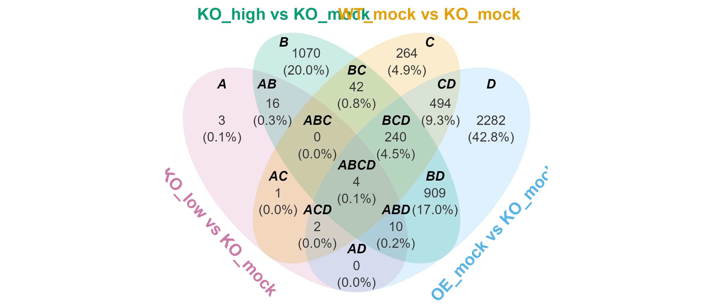

# **venny**

An R package for generating Venn diagram, summary tables, and ellipse
paths for polygon clipping. It provides direct access to subsets of
interest and offers flexible customization of Venn diagrams. Summary
tables are also available when Venn diagram visualization is not
suitable.

[Get
started](https://p10911004-npust.github.io/venny/articles/venny.html)

There are also other nice alternatives such as
[`ggvenn`](https://cran.r-project.org/package=ggvenn),
[`ggVennDiagram`](https://cran.r-project.org/package=ggVennDiagram),
[`UpSetR`](https://cran.r-project.org/package=UpSetR), and other
friends.

# Installation

You can install the package from
[CRAN](https://cran.r-project.org/package=venny) with:

``` r

install.packages("venny")
```

or the development version from
[GitHub](https://github.com/P10911004-NPUST/venny) with:

``` r

if (!require("pak")) install.packages("pak")
pak::pak("P10911004-NPUST/venny")
```

# Quick start

``` r

lst <- LGL23$DEGs
venny(lst)
```



example01

# TODO

Implement upset plot (depend on ggplot2 only)
